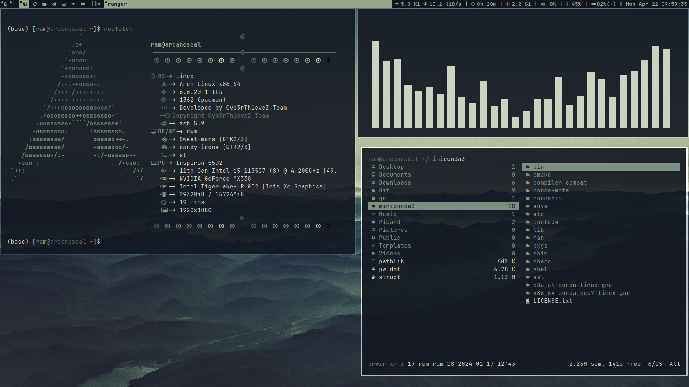
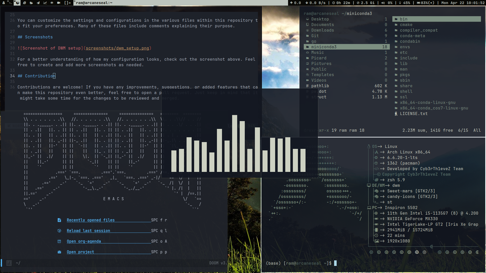

# Dotfiles Repository
  
This repository contains my personal configuration files for various applications and settings on Arch Linux with the DWM window manager. These files are essential for my system to look and function as I prefer. I recommend cloning this repository into your home directory (`~/`) for easy integration into your own setup.

## Prerequisites

To utilize these dotfiles, you need a system running Arch Linux with the DWM window manager installed. You will also require Git to clone and manage the repository. If you don't have it already, install Git using your package manager.

## Installation

1. I have used stow to manage the dotfiles, so you need to install stow:
```bash
sudo pacman -S stow
```

2. Clone this repository into your home directory:
```bash
git clone https://github.com/Chaganti-Reddy/dotfiles.git ~/dotfiles
```

3. Change into the `dotfiles` directory:
```bash
cd ~/dotfiles
```

4. Use stow to symlink the configuration files you want to use. For example, to install the DWM configuration files:
```bash 
stow suckless
```
Don't forget to use the dwm.desktop file to show dem in sddm from Extras/Extras/usr/share/xsessions

5. Repeat the stow command for any other configuration files you want to use.

6. Now all the configuration files are symlinked to your home directory, and .config directory. You can now use these configurations in your system.

7. To install the dwm, dmenu, st and slstatus, go to .config directory and make install in those respective folders:
```bash
cd .config/{}
sudo make clean install
```

8. There are still a lot application configurations and scripts which may be useful for you like ani-cli, grub theme etc., just go through every folder and fell free to use them in your system

9. Make sure there is no .stow-local-ignore files in the config directory you want to use, else it will ignore the files in that directory.

10. If you have any doubt feel free to comment it and make sure you watch the youtube videos regarding that particular application before commenting in github.

11. ALso there is an install.sh script which contains my packages list to install, check it and uncomment or comment lines as per your need

## Configuration

You can customize the settings and configurations in the various files within this repository to fit your preferences. Many of these files include comments explaining their purpose.

## Screenshots




For a better understanding of how my configuration looks, check out the screenshot above. Feel free to create and add more screenshots as needed.

## Programs

The main program I use for my daily life:

- **Window Manager**: DWM
- **Terminal**: ST
- **Shell**: Zsh
- **Editor**: Neovim, Doom Emacs
- **File Manager**: Ranger, Thunar
- **Browser**: QuteBrowser, Floorp, Brave
- **Music Player**: Mpd + Ncmpcpp
- **Video Player**: MPV
- **PDF Viewer**: Zathura/Okular
- **Image Viewer**: sxiv
- **Launcher**: DMenu
- **Notification Daemon**: Dunst
- **Screenshot Tool**: Flameshot
- **System Monitor**: Htop
- **Music Downloader**: Yt-dlp
- **Youtube Player**: Mpv + Ytfzf
- **Clipboard Manager**: Clipmenu
- **Screen Recorder**: OBS
- **IDE**: Visual Studio Code
- **Torrent Client**: Webtorrent, Peerflix
- **Office Suite**: LibreOffice
- **Password Manager**: Pass
- **Backup Tool**: Timeshift
- **System Information**: Neofetch
- **Anime Downloader**: Ani-cli 
- **Grub Theme**: Mocha Grub theme
- **Wallpapers**: Wallpapers from Wallhaven using waldl script 

For entire system I am using pywal for color scheme matching with wallpaper. And for zathura I am using Zathura-Pywal. And for webapps I am using firefoxpwa plugin. 

## License

This repository is licensed under the MIT License. For more information, see the `LICENSE` file.

## Contribution

Contributions are welcome! If you have any improvements, suggestions, or added features that can make this repository even better, feel free to open a pull request. Just keep in mind that it might take some time for the changes to be reviewed and merged.
