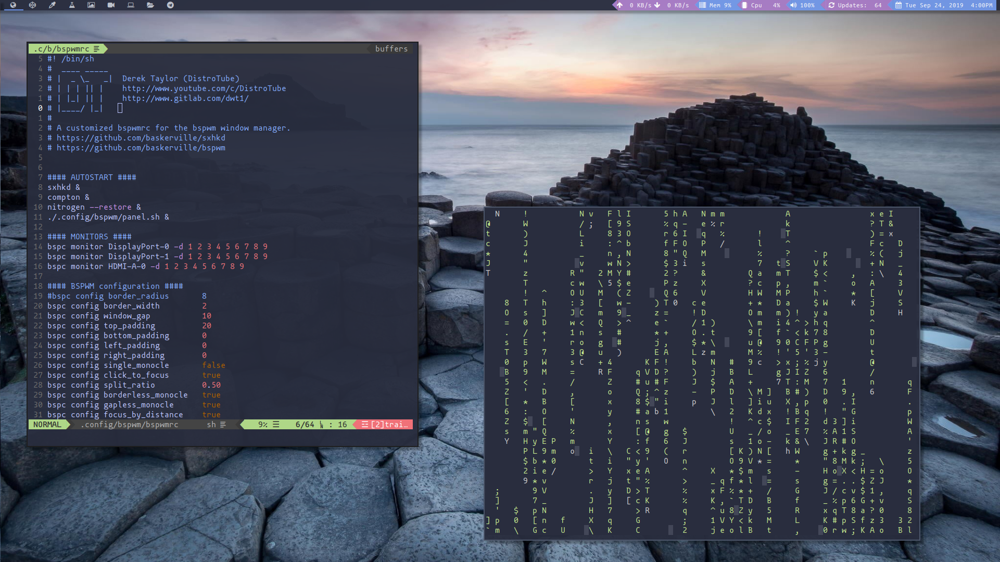

# My BSPWM Configuration



_bspwm_ is a tiling window manager that represents windows as the leaves of a full binary tree.

It only responds to X events, and the messages it receives on a dedicated socket.

_bspc_ is a program that writes messages on _bspwm_'s socket.

_bspwm_ doesn't handle any keyboard or pointer inputs: a third party program (e.g. _sxhkd_) is needed in order to translate keyboard and pointer events to _bspc_ invocations.

The outlined architecture is the following:

```
        PROCESS          SOCKET
sxhkd  -------->  bspc  <------>  bspwm
```

## Configuration

The default configuration file is `$XDG_CONFIG_HOME/bspwm/bspwmrc`: this is simply a shell script that calls _bspc_.

Keyboard and pointer bindings are defined with [sxhkd](https://github.com/baskerville/sxhkd).

Example configuration files can be found in the this directory.

## Monitors, desktops and windows

_bspwm_ holds a list of monitors.

A monitor is just a rectangle that contains desktops.

A desktop is just a pointer to a tree.

Monitors only show the tree of one desktop at a time (their focused desktop).

The tree is a partition of a monitor's rectangle into smaller rectangular regions.

Each node in a tree either has zero or two children.

Each internal node is responsible for splitting a rectangle in half.

A split is defined by two parameters: the type (horizontal or vertical) and the ratio (a real number _r_ such that _0 < r < 1_).

Each leaf node holds exactly one window.

# My Keybindings (defined by sxhkd)

The keybindings for bspwm are controlled by another program called sxhkd. You will find my sxhkdrc here: [sxhkdrc](https://github.com/Chaganti-Reddy/dotfiles/blob/master/home/user/.config/sxhkd/sxhkdrc)

The MODKEY is set to the Super key (aka the Windows key).

| Keybinding             | Action                                                                   |
| :--------------------- | :----------------------------------------------------------------------- |
| `ALT + CRTL + Enter`   | opens run launcher (dmenu is the run launcher but can be easily changed) |
| `MODKEY + Enter`       | opens terminal (st is the terminal but can be easily changed)            |
| `MODKEY + SHIFT + c`   | closes window with focus                                                 |
| `MODKEY + Esc`         | reloads the bspwm conifguration file                                     |
| `MODKEY + SHIFT + r`   | restarts bspwm                                                           |
| `MODKEY + SHIFT + q`   | quits bspwm                                                              |
| `MODKEY + j`           | switches focus between windows in the stack, going down                  |
| `MODKEY + k`           | switches focus between windows in the stack, going up                    |
| `MODKEY + SHIFT + j`   | rotates the windows in the stack, going down                             |
| `MODKEY + SHIFT + k`   | rotates the windows in the stack, going up                               |
| `MODKEY + t`           | set window state to tiled                                                |
| `MODKEY + s`           | set window state to pseudo-tiled                                         |
| `MODKEY + f`           | set window state to floating                                             |
| `MODKEY + 1-9`         | switch focus to workspace (1-9)                                          |
| `MODKEY + SHIFT + 1-9` | sends focused window to workspace (1-9)                                  |
